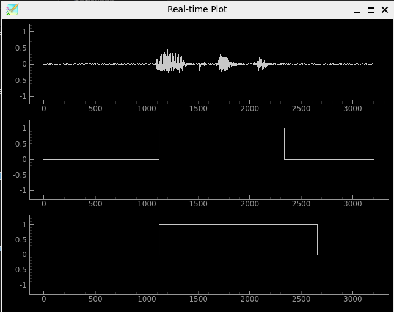

# Pyadintool #

Pyadintool is a pre-processing toolkit covering voice activity detection, recording, splitting and sending of audio stream. 
This toolkit has been developed as a simple python clone of [adintool](https://github.com/julius-speech/julius/blob/master/adintool/README.md) in [Julius](https://github.com/julius-speech/julius) Japanese ASR. 

## Key Features ##
### Interface ###
Suitable for real-time applications on PC, e.g., spoken dialogue system
* Support sending segmented audio data to (adin) servers
* Support long recording and saving it to files
* Support GUI plot for realtime monitoring
* Support batch processing using filelist

### Supported Voice Activity Detection (VAD) ###
Real-time processing on CPUs using multi-threading (desirable at least two or three cores)
* Power-based VAD in time domain
* DNN-HMM VAD in STFT domain
* [Silero VAD](https://github.com/snakers4/silero-vad)

### Example of ASR interface ###
* [Julius](https://github.com/julius-speech/julius) (in Japanese)
* [ESPnet](https://github.com/espnet/espnet) streaming ASR (in Japanese)
* [Faster Whisper](https://github.com/SYSTRAN/faster-whisper)

## VAD Features ##
### Common ###
* Better SNR (signal-to-noise ratio), better performance
* Better microphone (stand alone), better performance
* Near-field recording, better performance
* Uncompressed audio, better performance

### Power-based VAD ###
* Activity estimation based on signal power and its thresholding
* Assumptions
    * number of speakers: only one (single speaker)
* :smile: fast and light
* :frowning_face: unrobust against noise

### DNN-HMM VAD ###
* Activity estimation based on machine learning model: HMM and DNN
* Assumptions
    * number of speakers: only one (single speaker)
    * language: Japanese may be better (due to the model's training set)
* :smile: scale-invariant processing and multi-conditioned training of model
    * less includenced by the gain setting of audio devices
    * robust against assumed non-speech signals
* :frowning_face: performance dependency on model and training data (general in ML methods)
    * latter part of long vowels tends not to be detected
    * coughs are sometimes detected (not included in training data)

### [Silero VAD](https://github.com/snakers4/silero-vad) ###
* Activity estimation based on machine learning model: LSTM
* :smile: moderately fast and light, and stable performance
* :frowning_face: performance dependency on model and training data (general in ML methods)
    * latter part of long vowels tends not to be detected

## Installation ##
### System Requirements ###
* CPU: multi-core is better
    * No confirmation using CUDA
* Ubuntu 22.04, Ubuntu 22.04 on Windows WSL
    * :smile: Avairable: Power-based VAD, DNN-HMM VAD, Silero VAD
    * Required libraries
        * alsa-utils
        * libasound2-dev
        * libportaudio2
        * ..., and other GUI and audio libraries
* Windows 11 (basically not supported)
    * :smile: Avairable: Power-based VAD, Silero VAD
    * :frowning_face: Unavairable: DNN-HMM VAD (pytorch TransformerEncoderLayer is something wrong on windows?)
    * Latest windows updates
    * Solve problems (fbgemm.dll and its depended libomp140.x86_64.dll) as said in [issues](https://github.com/pytorch/pytorch/issues/131662)
        * latest Visual C++ x86/64 build tools from Visual Studio [Microsoft](https://visualstudio.microsoft.com/ja/vs/community/)
        * latest Visual C++ redistributable package from [Microsoft](https://learn.microsoft.com/ja-jp/cpp/windows/latest-supported-vc-redist) (for windows 10?)
        * (optional) other required modules for torchaudio, etc...
* Python3.10 or Python3.11 (Python3.9 if GUI plot is not used) and libraries
    * torch
    * torchaudio
    * numpy
    * pyyaml
    * sounddevice
    * huggingface_hub
    * savetensors
    * pyqtgraph (for real-time plot)
    * PySide6 (for real-time plot)
* ASR examples
    * ESPnet (on Ubuntu): Python3.10 (Python3.11 may cause error in sentencepiece)
    * Faster Whisper (on Ubuntu): Python3.10, Python3.11

### Setup on Ubuntu ###
<details><summary> expand </summary>

* Copy and edit the shell script: change the python version and other options
```
cp setup_ubuntu.sh setup_ubuntu_local.sh
```
```
python=python3.10
enable_espnet=true #false
python_espnet=python3.10
enable_whisper=false #true
python_whisper=python3.10
```

* Run "setup_ubuntu_local.sh" to automatically install necessary libraries for ubuntu environment. "sudo apt install" and "pip install" commands are used in the script.
    * Note: we have not specified actual required libaries. Therefore, some unnecessary libaries may be installed by "apt install". 

```
bash setup_ubuntu_local.sh
```
* Activate venv when you run our python scripts. The above script create "venv" environment (venv/main) in the current directory.
```
  venv/
    + main/    # venv for pyadintool
    + espnet/  # venv for ESPnet ASR (valid if enable_espent=true)
    + whisper/ # venv for Whisper ASR (valid if enable_whisper=true)
```
</details>

### Setup on Windows ###

<details><summary> expand </summary>

* Create virtual environemnt
```
python3 -m venv venv\main
.\venv\main\Scripts\activate
```
* Install python libraries by using batch file
```
setup_win.bat
```
* Sometimes edit the batch file to change the python version

</details>


## Run with default settings ##
* Activate appropriate virtual environment
```
. venv/main/bin/activate   # for ubuntu
```
```
.\venv\main\Scripts\activate    # for windows
```
* Pyadintool requires a configuration file for execution
```
python3 pyadintool.py [conf]
```
* Check avairable sound devices (device list) if necessary. 
```
python3 pyadintool.py devinfo
avairable device list---
  0 oss, ALSA (6 in, 6 out)
  1 pulse, ALSA (32 in, 32 out)
* 2 default, ALSA (32 in, 32 out)
  3 /dev/dsp, OSS (16 in, 16 out)
```

* Use the default configuration with DNN-HMM VAD
    * input stream: "mic"
    * output stream: "file" (saved in "result/" directory) 
    * sampling frequency and channel: 16k Hz and 1 
```
python3 pyadintool.py conf/default4asr.yaml
``` 

* Change the audio device by using "--device" option. The device ID (or name) must be selected from the device list. 
```
python3 pyadintool.py conf/default4asr.yaml --device 2
``` 

* Switch to power-based VAD or Silero VAD configuration if you want
```
python3 pyadintool.py conf/power4asr.yaml
``` 
```
python3 pyadintool.py conf/silero4asr.yaml
``` 

## Examples ##
### Example-01: Set an audio file as input stream ###
<details><summary> expand </summary>

```
python3 pyadintool.py conf/default4asr.yaml --in file
```
```
echo auido.wav | python3 pyadintool.py conf/default4asr.yaml --in file
```
</details>

### Example-02: Save segmented audio signals to files  ###
<details><summary> expand </summary>

```
python3 pyadintool.py conf/default4asr.yaml --out file
```
```
python3 pyadintool.py conf/default4asr.yaml --out file --filename segs/result_%Y%m%d_%H%M_%R.wav --startid 0
```
* Available format
    * %Y: year
    * %m: month
    * %d: day
    * %H: hour
    * %M: minutes
    * %S: second
    * %u: host name
    * %R: rotation id
</details>

### Example-03: Send segmented audio signals to ASR servers  ###
<details><summary> expand </summary>

* Run "adinnet" server (ASR example) before running "pyadintool.py". This server receives segmented audio data from "pyadintool.py" client. 
* Set up ESPnet or Whisper
```
. venv/espent/bin/activate
python3 egs_asr.py ESPnet
``` 
```
. venv/whisper/bin/activate
python3 egs_asr.py Whisper
``` 
* or, set up Julius 
```
sudoapt install git-lfs
git lfsinstall
git clone https://github.com/julius-speech/dictation-kit
cd dictation-kit
sh run-linux-dnn.sh -input adinnet -adport 5530
```
* Then, run the main script with adinnet option. Stop it by Ctrl-C. 
```
python3 pyadintool.py conf/default4asr.yaml --out adinnet
```
```
python3 pyadintool.py conf/default4asr.yaml --out adinnet --server localhost --port 5530
```
* Send data to several ASRs
```
python3 pyadintool.py conf/default4asr.yaml --out adinnet --server localhost,l92.168.1.30 --port 5530,5530
```
</details>

### Example-04: Set multiple output streams ###
<details><summary> expand </summary>

```
python3 pyadintool.py conf/default.yaml --out adinnet-file
```
</details>

### Example-05: Save timesamps of VAD to a file  ###
<details><summary> expand </summary>

```
python3 pyadintool.py conf/default.yaml --enable_timestamp --timestampfile result.lab
```
</details>

### Example-06: Logging  ###
<details><summary> expand </summary>

* In the case of long recording, the logging is important to check the behavior of "pyadintool.py"
    * "buffer overflow" while reading audio from device may happen
```
python3 pyadintool.py conf/default4asr.yaml --enable_logsave
```
```
python3 pyadintool.py conf/default4asr.yaml --enable_logsave --logfilefmt log_%Y%m%d.log
```
* Available file format
    * %Y: year
    * %m: month
    * %d: day
    * %H: hour
    * %M: minutes
    * %S: second
    * %u: host name
    * %R: rotation id
</details>

### Example-07: Batch processing for filelist ###
<details><summary> expand </summary>

```
python3 pyadintool.py conf/default4asr.yaml --enable_list --inlist wavlist.txt --tslist tslist.txt
```

Filenames of Audio and label data are listed in "wavlist.txt" and "tslist.txt"
```
data001.wav
data002.wav
```
```
data001.lab
data002.lab
```
</details>

### Example-08: Set input device name or ID ###
<details><summary> expand </summary>

```
python3 pyadintool.py conf/default4asr.yaml --device default
```
</details>

### Example-09: Real-time plot for monitoring ###
<details><summary> expand </summary>

```
python3 pyadintool.py conf/default4asr.yaml --enable_plot
```
* Clikc the close button of the window to stop

</details>

### Example-10: Save raw recording to files
<details><summary> expand </summary>

```
python3 pyadintool.py conf/default4asr.yaml --enable_rawsave
```
```
python3 pyadintool.py conf/default4asr.yaml --enable_rawsave --rawfilefmt raw/%Y%m%d/record_%u_%R_%H%M%S.wav
```
</details>

## Tuning/Change Configuration ##
Some parameters should be set through yaml configuration files such as "default4asr.yaml", "power4asr.yaml" and "silero4asr.yaml".

### Common: sampling frequency ###
<details><summary> expand </summary>

* Change "freq" parameter in configuration file
* "freq" parameter is included in several modules
* We also need to change several parameters because they are described in "sample" unit
</details>

### Common: margin parameter ###
<details><summary> expand </summary>

* Change "magin_begin" and "margin_end" parameters. Their unit is "second".
```
postproc:
  package: usr.tdvad
  class: PostProc
  params:
    freq: 16000
    margin_begin: 0.20
    margin_end: 0.20
    shift_time: 0.23
```
</details>

### Power-based VAD: threshold parameter
<details><summary> expand </summary>

* Change "flramp" parameter ranged in [0, 32768]. Smaller is more sensitive to signal power
* Change "n_win" parameter to use long window for calculating moving averaged power  
```
  package: usr.tdvad
  class: SimpleVAD
  params:
    n_win: 800
    n_skip: 80
    flramp: 500
    thre: 0.5
    nbits: 16
```
</details>

### DNN-HMM VAD: threshold parameter
<details><summary> expand </summary>

* Change "pw_1" parameter in "dnnhmmfilter.yaml". Smaller is more sensitive to speech signal, which is effective under high SNR environments 
```
probfilter:
  classname: BinaryProbFilter
  package: usr.fdvad
  params:
    trp1_self: 0.99
    trp2_self: 0.99
    pw_1: 0.5
```
</details>

## Options ##
All default parameters need to be set in the configuration file. The command line options will overwrite the default configurations.

<details><summary> expand </summary>

### --in [IN] ###
* Set input stream. "mic" or "file".
### --out [OUT] ### 
* Set output stream. "file", "adinnet" and both "adinnet-file"
* Data format of "adinnet"
    * segmented data
        * 4-byte int: represents audio data length in bytes (N)
        * N bytes: binary audio data
    * end of segment
        * 4-byte int: 0 (zero)

### --filename [FILENAME] ###
* Set output filename 

### --startid [ID] ###
* Set start id for rotation filename, e.g., 0
* "%R" in filename is replaced into the current rotation ID

### --server [HOSTNAME] ###
* Set hostnames of adinserver, e.g., localhost

### --port [PORT] ###
* Set ports of adinserver, e.g., 5530

### --freq [FREQ] ###
* Set sampling frequency of input stream in Hz, e.g., 16000

### --nch [NCH] ###
* Set sampling frequency of input stream in Hz, e.g., 1

### --device [DEVICE] ###
* Set ID or name of audio device, e.g., 1

### --infile [INFILE] ###
* Set input audio filename if "--in file" is valid
* Avairable only if "--in file" option is set

### --enable_logsave ###
* Save log to the file

### --logfilefmt [LOGFILEFMT] ###
* Set fileformat for log
* Avairable only if "--enable_logsave" option is set

### --enable_rawsave ###
* Save raw input stream to the file

### --rawfilefmt [LOGFILEFMT] ###
* Set fileformat for raw audio data, e.g., "rawfile_%Y%d%m_%R.wav"
* Avairable only if "--enable_rawsave" option is set

### --rotate_min [ROTATE_MIN] ###
* Set duration time in minutes for saving raw audio files, e.g., 30
* Avairable only if "--enable_rawsave" option is set

### --enable_timestamp ###
* Save timestamp of audio segments to the file

### --timestampfile [TIMESTAMPFILE] ###
* Set filename for saving timestamps
* Avairable only if "--enable_timestamp" option is set

### --enable_plot ###
* Plot waveform and speech activity on GUI

### --enable_list ###
* Run batch processing

### --inlist [INLIST] ###
* Set audio file list for batch processing
* Avairable only if "--enable_list" option is set

### --tslist [TSLIST] ###
* Set timestamp file list for batch processing
* Avairable only if "--enable_list" option is set


</details>

## Citations ##
