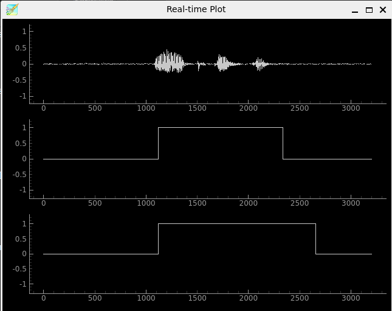

# Pyadintool #

Pyadintool is a pre-processing toolkit covering voice activity detection, recording, splitting and sending of audio stream. 
This toolkit has been developed as a simple python clone of [adintool](https://github.com/julius-speech/julius/blob/master/adintool/README.md) in [Julius](https://github.com/julius-speech/julius) Japanese ASR. 
This toolkit is developed mainly for academic research (easy to use) and example use. 
Note that coding standards, error handling, comments and so on in this toolkit are not suitable for joint development. 


- 2026/05: A bug may be fixed. VAD behavior becomes more stable. 
- 2025/11: release version 1.0 -- packaging as `pyadin`. we can `pip install` it from github repository.
  - caution: directory structure/path had been changed

## Key Features ##
### Interface ###
Suitable for real-time applications on PC, e.g., spoken dialogue system
* Support sending segmented audio data to (adin) servers
* Support long recording and saving it to files
* Support GUI plot for realtime monitoring
* Support batch processing using filelist

Tentative function
* Echo cancellation (suppression of a known signal) using pre-trained filter

### Supported Voice Activity Detection (VAD) ###
Real-time processing on CPUs using multi-threading (desirable at least two or three cores)
* Power-based VAD in time domain
* DNN-HMM VAD in STFT domain
* [Silero VAD](https://github.com/snakers4/silero-vad)

### Example of ASR interface ###
* [Julius](https://github.com/julius-speech/julius) (in Japanese)
* [ESPnet](https://github.com/espnet/espnet) streaming ASR (in Japanese)
* [Faster Whisper](https://github.com/SYSTRAN/faster-whisper)

## VAD Features ##
### Common ###
* Better SNR (signal-to-noise ratio), better performance
* Better microphone (stand alone), better performance
* Near-field recording, better performance
* Uncompressed audio, better performance
* Performance may be affected by other settings
    * sampling frequency
    * amplitude characteristics of low-pass filter used for band limitation
    * source separation, speech enhancement, noise reduction and echo cancellation methods 

### Power-based VAD ###
* Activity estimation based on signal power and its threshold parameter
* Assumptions
    * number of speakers: only one (single speaker)
* :smile: fast and light
* :frowning_face: un-robust against noise

### DNN-HMM VAD ###
* Activity estimation based on machine learning model: HMM and DNN
* Assumptions
    * number of speakers: only one (single speaker)
    * language: Japanese may be better (due to the model's training set)
    * acceptable latency: 0.2 sec. 
* :smile: scale-invariant processing and multi-conditioned training of model
    * less influenced by the gain setting of audio devices
    * robust against assumed non-speech signals
    * stable for long recording such as spoken dialogue data
* :frowning_face: performance dependency on model and training data (general in ML methods)
    * latter part of long vowels tends not to be detected
    * coughs are sometimes detected (not included in training data)
    * consonant-like noise are sometimes detected
* :ok_hand: Several model parameters (2025/7/16 updated)</span>
    * v1 -- Trial setup for scale-invariant processing: Acc. 93.20, F1 94.14.
    * v2 -- Robustness against noise was improved to some extent, and model size becomes lighter: Acc. 94.20, F1 94.61.

### [Silero VAD](https://github.com/snakers4/silero-vad) ###
* Activity estimation based on machine learning model: LSTM
* :smile: moderately fast and light, and stable performance
* :frowning_face: performance dependency on model and training data (general in ML methods)
    * latter part of long vowels tends not to be detected

## Installation ##
### System Requirements ###
* CPU: multi-core is better
    * No confirmation using CUDA
* Ubuntu 22.04, Ubuntu 22.04 on Windows WSL
    * :smile: Available: Power-based VAD, DNN-HMM VAD, Silero VAD
    * Required libraries
        * alsa-utils
        * libasound2-dev
        * libportaudio2
        * ..., and other GUI and audio libraries
* Windows 11 (basically not supported)
    * :smile: Available: Power-based VAD, Silero VAD
    * :frowning_face: Unavailable: DNN-HMM VAD (pytorch TransformerEncoderLayer is something wrong on windows?)
    * Latest windows updates
    * Solve problems (fbgemm.dll and its depended libomp140.x86_64.dll) as said in [issues](https://github.com/pytorch/pytorch/issues/131662)
        * latest Visual C++ x86/64 build tools from Visual Studio [Microsoft](https://visualstudio.microsoft.com/ja/vs/community/)
        * latest Visual C++ redistributable package from [Microsoft](https://learn.microsoft.com/ja-jp/cpp/windows/latest-supported-vc-redist) (for windows 10?)
        * (optional) other required modules for torchaudio, etc...
* Python3.10 or Python3.11 (Python3.9 if GUI plot is not used) and main libraries. See "requirements.txt" for details.
    * torch
    * torchaudio
    * torchcodec (added 2025/11/06. required for audio file)
    * numpy
    * pyyaml
    * sounddevice
    * huggingface_hub
    * safetensors
    * pyqtgraph (for real-time plot)
    * PySide6 (for real-time plot)    
* ASR examples
    * ESPnet (on Ubuntu): Python3.10
        * Python3.11 may cause error in installing "sentencepiece"
    * Faster Whisper (on Ubuntu): Python3.10, Python3.11

### Setup on Ubuntu ###
<details><summary> expand </summary>

#### Shell script ####
* Copy and edit the shell script: change the python version and other options
```
cp setup_ubuntu.sh setup_ubuntu_local.sh
```
```
python=python3.10
enable_espnet=true #false
python_espnet=python3.10
enable_whisper=false #true
python_whisper=python3.10
```

* Run "setup_ubuntu_local.sh" to automatically install necessary libraries for ubuntu environment. "sudo apt install" and "pip install" commands are used in the script.
    * Note: we have not specified actual required libaries. Therefore, some unnecessary libaries may be installed by "apt install". 

```
bash setup_ubuntu_local.sh
```
* Activate venv when you run our python scripts. The above script create "venv" environment (venv/main) in the current directory.
```
  venv/
    + main/    # venv for pyadintool
    + espnet/  # venv for ESPnet ASR (valid if enable_espent=true)
    + whisper/ # venv for Whisper ASR (valid if enable_whisper=true)
```

#### pip command for python libraries ####
* Appropriate python version and virtual environment are assumed
* Python libraries can be also installed by using "requirements.txt" for "pyadintool" (exact versions in our environment)
```
pip3 install -r requirements.txt
```

* (Optional) ESPnet and Faster Whisper can be installed simply by
```
pip3 install espnet torchaudio torchcodec espnet_model_zoo
```
```
pip3 install faster_whisper
```

</details>


### Setup on Windows ###

<details><summary> expand </summary>

* Create virtual environemnt
```
python3 -m venv venv\main
.\venv\main\Scripts\activate
```
* Install python libraries by using batch file
```
setup_win.bat
```
* Sometimes edit the batch file to change the python version

</details>


## Run with default settings ##
### General procedure
* Activate appropriate virtual environment
```
. venv/main/bin/activate   # for ubuntu
```
```
.\venv\main\Scripts\activate    # for windows
```
* Pyadintool requires a configuration file for execution
```
python3 pyadintool.py [conf]
```
* Check available sound devices (device list) if necessary. 
```
python3 pyadintool.py devinfo
--- available device list ---
  0 oss, ALSA (6 in, 6 out)
  1 pulse, ALSA (32 in, 32 out)
* 2 default, ALSA (32 in, 32 out)
  3 /dev/dsp, OSS (16 in, 16 out)
```

* Use the default configuration with DNN-HMM VAD
    * input stream: "mic"
    * output stream: "file" (saved in "result/" directory) 
    * sampling frequency and channel: 16k Hz and 1 
```
python3 pyadintool.py conf/default4asr.yaml
``` 
* We can also try our latest model version as
```
python3 pyadintool.py conf/default4asr_v2.yaml
``` 

* Change the audio device by using "--device" option. The device ID (or name) must be selected from the device list. 
```
python3 pyadintool.py conf/default4asr.yaml --device 2
``` 

* Switch to power-based VAD or Silero VAD configuration if you want
```
python3 pyadintool.py conf/power4asr.yaml
``` 
```
python3 pyadintool.py conf/silero4asr.yaml
``` 

### Recommended trial command for monaural microphone input
The following command displays the input signal and detection results for monitoring. 
```
python3 pyadintool.py conf/default4asr_v2.yaml --enable_plot
```

## Examples ##
### Example-01: Set an audio file as input stream ###
<details><summary> expand </summary>

```
python3 pyadintool.py conf/default4asr.yaml --in file --infile audio.wav
```
```
echo auido.wav | python3 pyadintool.py conf/default4asr.yaml --in file
```
</details>

### Example-02: Save segmented audio signals to files  ###
<details><summary> expand </summary>

```
python3 pyadintool.py conf/default4asr.yaml --out file
```
```
python3 pyadintool.py conf/default4asr.yaml --out file --filename segs/result_%Y%m%d_%H%M_%R.wav --startid 0
```
* Available format
    * %Y: year
    * %m: month
    * %d: day
    * %H: hour
    * %M: minutes
    * %S: second
    * %u: host name
    * %R: rotation id
</details>

### Example-03: Send segmented audio signals to ASR servers  ###
<details><summary> expand </summary>

* Run "adinnet" server (ASR example) before running "pyadintool.py". This server receives segmented audio data from "pyadintool.py" client. 
* Set up ESPnet or Whisper
```
. venv/espent/bin/activate
python3 egs_asr.py ESPnet
``` 
```
. venv/whisper/bin/activate
python3 egs_asr.py Whisper
``` 
* or, set up Julius 
```
sudo apt install git-lfs
git lfsinstall
git clone https://github.com/julius-speech/dictation-kit
cd dictation-kit
sh run-linux-dnn.sh -input adinnet -adport 5530
```
* Then, run the main script with adinnet option. Stop it by Ctrl-C. 
```
python3 pyadintool.py conf/default4asr.yaml --out adinnet
```
```
python3 pyadintool.py conf/default4asr.yaml --out adinnet --server localhost --port 5530
```
* Send data to several ASRs
```
python3 pyadintool.py conf/default4asr.yaml --out adinnet --server localhost,l92.168.1.30 --port 5530,5530
```
</details>

### Example-04: Set multiple output streams ###
<details><summary> expand </summary>

Just include several options in a string, such as "adinnet" and "file". 
```
python3 pyadintool.py conf/default.yaml --out adinnet-file
```
</details>

### Example-05: Save timesamps of VAD to a file  ###
<details><summary> expand </summary>

```
python3 pyadintool.py conf/default.yaml --enable_timestamp --timestampfile result.lab
```
</details>

### Example-06: Logging  ###
<details><summary> expand </summary>

* In the case of long recording, the logging is important to check the behavior of "pyadintool.py"
    * e.g. "buffer overflow" may happen while reading audio signal from device
```
python3 pyadintool.py conf/default4asr.yaml --enable_logsave
```
```
python3 pyadintool.py conf/default4asr.yaml --enable_logsave --logfilefmt log_%Y%m%d.log
```
* Available file format
    * %Y: year
    * %m: month
    * %d: day
    * %H: hour
    * %M: minutes
    * %S: second
    * %u: host name
    * %R: rotation id
</details>

### Example-07: Batch processing for filelist ###
<details><summary> expand </summary>

```
python3 pyadintool.py conf/default4asr.yaml --enable_list --inlist wavlist.txt --tslist tslist.txt
```

Filenames of Audio and label data are listed in "wavlist.txt" and "tslist.txt"
```
data001.wav
data002.wav
```
```
data001.lab
data002.lab
```
</details>

### Example-08: Set input device name or ID ###
<details><summary> expand </summary>

```
python3 pyadintool.py conf/default4asr.yaml --device default
```
</details>

### Example-09: Real-time plot for monitoring ###
<details><summary> expand </summary>

```
python3 pyadintool.py conf/default4asr.yaml --enable_plot
```
* Clikc the close button of the window to stop

</details>

### Example-10: Save raw recording to files
<details><summary> expand </summary>

Output file will be automatically rotated after "rotate_min". 
```
python3 pyadintool.py conf/default4asr.yaml --enable_rawsave
```
"%R" should be used in the fileformat options to avoid overwriting. 
```
python3 pyadintool.py conf/default4asr.yaml --enable_rawsave --rawfilefmt raw/%Y%m%d/record_%u_%R_%H%M%S.wav
```
```
python3 pyadintool.py conf/default4asr.yaml --enable_rawsave --rawfilefmt raw/%Y%m%d/record_%u_%R_%H%M%S.wav --rotate_min 30
```
</details>


### Example-11: Set up for real-time ASR applications using adinnet
<details><summary> expand </summary>

It is better to create a new configuration file for this purpose. 
```
python3 pyadintool.py conf/default4asr.yaml --in mic --out file-adinnet --enable_logsave --enable_rawsave --server localhost --port 5530
```
</details>


### Example-12: Use echo canceller (tentative)
<details><summary> expand </summary>

This function assumes the cancellation of system utterances for spoken dialogue system.   
Available under limited environment.
* Valid only for "--in mic" option
* 2-channel audio inputs
    * ch1: microphone input signal
    * ch2: loopback signal (output signal from loud speaker)
* Static transfer function
    * position of mic. and loud speaker never changes
* Filter estimation in advance for stable performance
* Incomplete cancellation
    * VAD may still detect system utterances

Run "auxtool" to estimate filter in advance. Filter parameters are saved in "conf/ecfilter.txt" file.
```
python3 auxtool.py calib_filter
```
Run "pyadintool" with the configuration file for echo cancellation.
```
python3 pyadintool.py config/default4ecasr.yaml --in mic --enable_plot
```
If you want to update filter parameters dynamically, change the learning rate ("mu") of "lms" in the configuration file.
```
enable_ec: True
lms:
  L: 512
  mu: 0.0
  filterfile: conf/ecfilter.txt
  floorfile: 
```

</details>


## Tuning/Change Configuration ##
Some parameters should be set through yaml configuration files such as "default4asr.yaml", "power4asr.yaml" and "silero4asr.yaml".

If you want to discad `backgournd speech` (not target speaker) with low power, please set the `min_thre` parameter that is a threahold of power (energy) feature.

### Common: sampling frequency ###
<details><summary> expand </summary>

* Change "freq" parameter in configuration file
* "freq" parameter is included in several modules
* We also need to change several parameters because they are described in "sample" unit
</details>

### Common: margin parameters for audio segmentation ###
<details><summary> expand </summary>

* Change "margin_begin" and "margin_end" parameters. Their unit is "second".
* "shift_time" represents a buffering time (inevitable latency) of each method
    * the detected times of each segment are modified by this parameter in order to set the internal time to actual time. 
* These default configurations are different among methods. 
```
postproc:
  package: pyadin.tdvad
  class: PostProc
  params:
    freq: 16000
    margin_begin: 0.20
    margin_end: 0.20
    shift_time: 0.23
```
</details>

### Power-based VAD: threshold parameter
<details><summary> expand </summary>

* Change "flramp" parameter ranged in [0, 32768]. Smaller is more sensitive to signal power
* Change "n_win" parameter to use longer window for calculation of moving averaged power
```
  package: pyadin.tdvad
  class: SimpleVAD
  params:
    n_win: 800
    n_skip: 80
    flramp: 500
    thre: 0.5
    nbits: 16
```
</details>

### DNN-HMM VAD: threshold parameter
* Change "pw_1" parameter in `probfilter` class. Smaller is more sensitive to speech signal.
* The value "0.1" or smaller may be effective under high SNR environments. 
* A detection threshold using power (energy) feature can be set to ignore low-power backgroud noises, speech signal and residual signals from echo canceller. Change the "min_thre" value according to your environment. 
```
tagger:
  package: pyadin.fdvad
  class: stftSlidingVAD
  params:
    dnnhmmconf:
      probfilter:
        classname: BinaryProbFilter
        package: pyadin.fdvad
        params:
          trp1_self: 0.99
          trp2_self: 0.99
          pw_1: 0.5
      classifier:
        classname: SITEVoiceClassifier
        package: pyadin.nn
        path: ouktlab/pyadintool-fdvad-SITEVoiceClassifier-l-avg10-v2408
      n_bwd: 50
      n_fwd: 0
      n_offset: 20
    min_frame: 2
    nshift: 160
    nbuffer: 12000
    device: cpu
    dtype: float32
    nthread: 3
    min_thre: 1.0  # no threshold if we set it to 0.0.  
```
* The thoreshold above can be estimated via pre-recording using "auxtool.py" in advance because this threshold value is obviously affected by your recording conditions.
```
$ python3 auxtools.py calib_framepower
[LOG]: calibrate power
[LOG]: now recording ...
[LOG]: estimated frame-power: mean: 0.7391, std: 0.1577
```


### Silero VAD: threshold parameter
<details><summary> expand </summary>

* Change "thre" parameter. Smaller is more sensitive to signal power
```
tagger:
  package: pyadin.silerovad
  class: SileroVAD
  params:
    freq: 16000
    thre: 0.5
```
</details>


## Options ##
All default parameters need to be set in the configuration file. The command line options will overwrite the default configurations.

<details><summary> expand </summary>

### --in [IN] ###
* Set input stream. `mic` or `file`.

### --out [OUT] ### 
* Set output stream. `file`, `adinnet`, `queue` and both `adinnet-file`
  *  `queue` is used for raw audio data processing
* Data format of `adinnet` in TCP/IP communication
    * segmented data
        * 4-byte int: represents audio data length in bytes (N)
        * N bytes: binary audio data
    * end of segment
        * 4-byte int: 0 (zero)

### --filename [FILENAME] ###
* Set output filename 

### --startid [ID] ###
* Set start id for rotation filename, e.g., `0`
* `%R` in filename is replaced into the current rotation ID

### --server [HOSTNAME] ###
* Set hostnames (or IPs) of adinserver, e.g., `localhost`

### --port [PORT] ###
* Set ports of adinserver, e.g., `5530`

### --freq [FREQ] ###
* Set sampling frequency of input stream in Hz, e.g., `16000`

### --nch [NCH] ###
* Set sampling frequency of input stream in Hz, e.g., `1`

### --tgt_chs [TGT_CHS] ###
* Set target channels, e.g., as `--tgt_chs 0 1`. 
* Selected channels will be extracted from audio input stream. 

### --device [DEVICE] ###
* Set ID or name of audio device, e.g., `1`

### --infile [INFILE] ###
* Set input audio filename if `--in file` is valid
* Available only if `--in file` option is set

### --enable_logsave ###
* Save log to the file

### --logfilefmt [LOGFILEFMT] ###
* Set fileformat for log
* Available only if `--enable_logsave` option is set

### --enable_rawsave ###
* Save raw input stream to the file

### --rawfilefmt [LOGFILEFMT] ###
* Set fileformat for raw audio data, e.g., `rawfile_%Y%d%m_%R.wav`
* Available only if `--enable_rawsave` option is set

### --rotate_min [ROTATE_MIN] ###
* Set duration time in minutes for saving raw audio files, e.g., 30
* Available only if `--enable_rawsave` option is set

### --enable_timestamp ###
* Save timestamp of audio segments to the file

### --timestampfile [TIMESTAMPFILE] ###
* Set filename for saving timestamps
* Available only if `--enable_timestamp` option is set

### --enable_plot ###
* Plot waveform and speech activity on GUI

### --enable_list ###
* Run batch processing

### --inlist [INLIST] ###
* Set audio file list for batch processing
* Available only if `--enable_list` option is set

### --tslist [TSLIST] ###
* Set timestamp file list for batch processing
* Available only if `--enable_list` option is set

</details>


## Use as Package
### Pip install via github
#### 0. Install system libraries
We need to install the system libraries, e.g., of Ubuntu by `apt install` command.   
It may include `alsa-utils`, `libasound2-dev`, `libporaudio2`, and so on.   
It is better to follow the `setup_ubutu.sh` for their installtions.

#### 1. Activate virtual environment
```
python3 -m venv venv
. venv/bin/activate
```
#### 2. Install pyadintool by pip from GitHub
```
python3 -m pip install git+https://github.com/ouktlab/pyadintool.git
```
Please use the following command if you want to enable wave plot.
```
python3 -m pip install pyadintool[gui]@git+https://github.com/ouktlab/pyadintool.git
```

#### 3. Import "pyadin" package (not "pyadintool")
```
import pyadin
```

### Example
#### Run test program
For example, please create `main.py` which is the same source code as `pyadintool.py`
```
import pyadin
if __name__ == "__main__":
    pyadin.app_pyadintool()
```
Then, run the `main.py` with package's default configuration file `egs_conf/default4asr.yaml`.
```
python3 main.py egs_conf/default4asr.yaml --enable_plot
```

#### Use package command
We can run directly `pyadintool` and `pyadinauxtool` as commands instead of `pyadintool.py` and `auxtool.py` after `pip istall`.

```
pyadintool egs_conf/default4asr.yaml --enable_plot
```

We can also switch the configuration file to your own one at your local directory.

#### Realtime processing of segmented audio data 
If you want to process raw audio data segmented by VAD, you can use `setup_pipeline` module.   
The following is its example (`egs_increment.py`), and we can access the audio data via `Queue`.  
```
import pyadin
import queue

if __name__ == "__main__":
    q = queue.Queue()
    pipeline = pyadin.setup_pipeline(q)
    pipeline.open()
    while pipeline.update() is not None:
        while q.empty() is False:
            audioseg = q.get()
            if audioseg['is_end'] is False:
                # some processes here
                #print('', len(audioseg['audio']), type(audioseg['audio']), flush=True)
                pass
            del audioseg
    pipeline.close()
```
The stored data in the queue is dict type and has two keys: `is_end` and  `audio`. If the value of `is_end` is `True`, audio (speech signal) segment is stored as a value of the `audio` key. If the value of `is_end` is `True`, speech section has finished. Non-speech segments are not stored in the `Queue`.

Note that the segment size is decided by the `souddevice` library. The size usually ranges from 160 samples (0.01 s) to 800 samples (0.05 s). 


The default configuration file is in the `egs_conf` package's directory. 
The output sink is set to the `Queue` by `--out queue` option as default in the file. 
```
python3 egs_increment.py egs_conf/default4inc.yaml
```

Audio device access may be allowed only in the main thread (process). 
Therefore, your processing may be better to be implemented as sub-thread/process if you use `multiprocessing` libarary. 

#### Adinserver and others
We can access our python modules in the `pyadin` directory by importing them.   
The following is the case of `adinserver`. 
```
import pyadin.adinserver
adinserver = pyadin.adinserver.AdinnetServer('localhost', 5530)
```

## Citations
```
@inproceedings {
  author={Ryu Takeda and Kazunori Komatani},
  title={Scale-invariant Online Voice Activity Detection under Various Environments},
  year={2024},
  booktitle={Proceedings of Asia-Pacific Signal and Information Processing Association Annual Summit and Conference (APSIPA ASC)},
  pages={1--6},
  doi={10.1109/APSIPAASC63619.2025.10848584},
}
```
